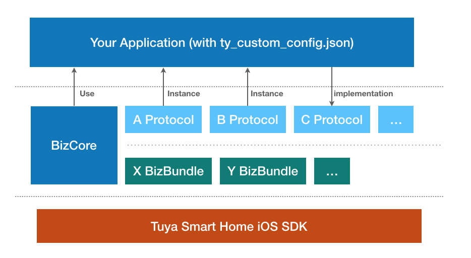
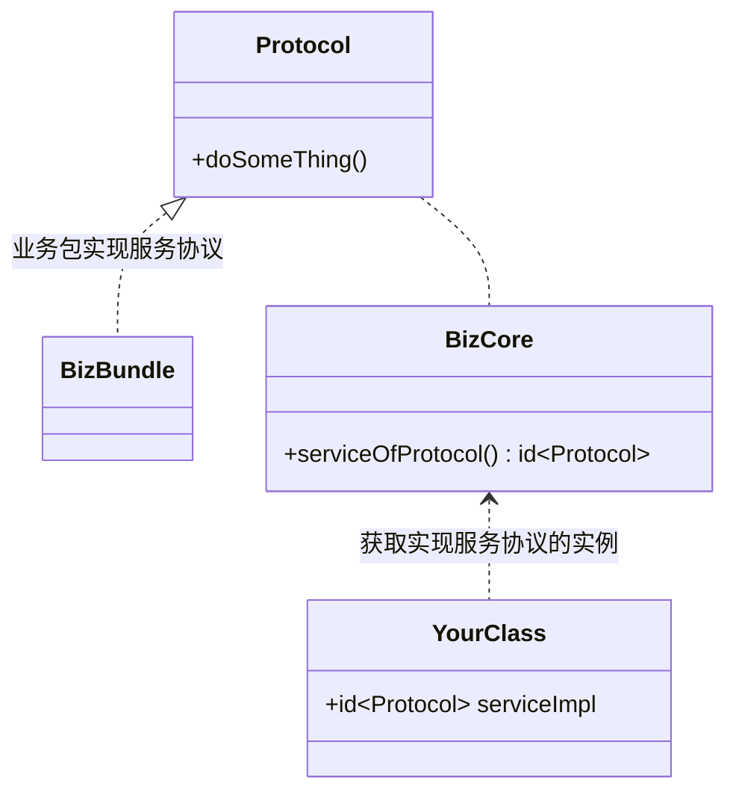
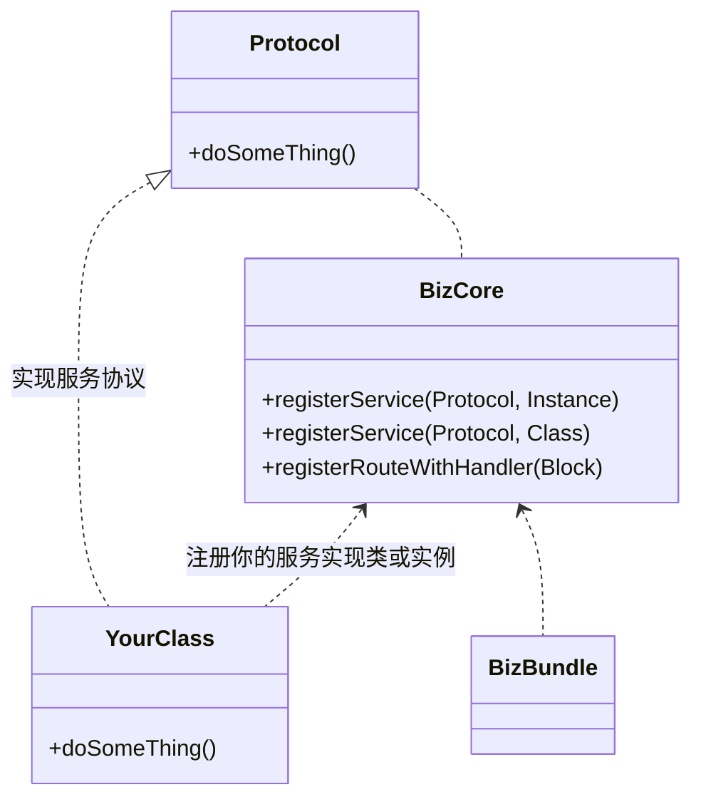

# Tuya iOS BizBundle

## Overview

Tuya iOS BizBundle is a vertical business bundle that contains logic modules and UI pages. It's designed to provide customers with the ability to quickly access the Tuya business module based on the Tuya Smart Home SDK.

Tuya iOS BizBundle currently offered includes:
- H5 Mall
- Device Control Panel
- IPC Device Control Panel
- Device Activation

## Architecture

Tuya iOS BizBundle is opened in a service-oriented manner, and all function access is provided in the form of `Protocol`.

There are two ways to use the protocol: **get service** and **provide service**

### Get Service

Obtain the instance which implement the service protocol provided by the BizBundle through `BizCore`, then call its service method to achieve the business purpose

### Provide Service

Some BizBundle depend on services that are not implemented, At this time, you can provide your own class to implement the corresponding service, and register it to `BizCore` to improve the BizBundle functions

